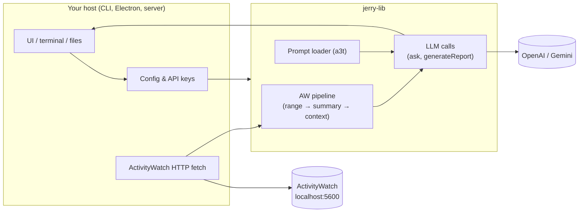

# @sarkarshubhdeep/jerry-lib

[](https://jsr.io/@sarkarshubhdeep/jerry-lib)
[](https://jsr.io/@sarkarshubhdeep/jerry-lib)

**Intro:** [Watch the jerry-lib overview (YouTube Short)](https://www.youtube.com/shorts/0yqtKkbfyPU)

The Jerry **engine** — a TypeScript library that turns ActivityWatch data into work narratives and chat replies using LLMs (OpenAI and Gemini).

**JSR:** [jsr.io/@sarkarshubhdeep/jerry-lib](https://jsr.io/@sarkarshubhdeep/jerry-lib) · **API:** [jsr.io/.../doc](https://jsr.io/@sarkarshubhdeep/jerry-lib/doc) · **Guides:** [docs/](https://github.com/SarkarShubhdeep/jerry-lib/tree/main/docs)

---

## What is this?

**Jerry** helps you understand what you've been working on. It reads ActivityWatch window and web activity, formats it for an LLM, and produces summaries like _"Yesterday you spent 3h on the jerry-client repo and reviewed PR #42."_

**jerry-lib** is the shared brain behind Jerry. It is **not** an app you install and run — it is a library you import into your own project.

| You want… | Use this instead |
| --- | --- |
| A Mac menu-bar chat app | [**jerry-client**](https://github.com/SarkarShubhdeep/jerry-client) (Electron) |
| Terminal work reports (`.md` files) | [**jerry-cli**](https://github.com/SarkarShubhdeep/jerry-client/tree/main/jerry-cli) (in the same repo) |
| Jerry inside your own CLI, Electron app, cron job, or backend | **jerry-lib** (this package) |

Both reference hosts above already use jerry-lib. Fork their patterns or build something new.

> **See Jerry in action:** [jerry-client](https://github.com/SarkarShubhdeep/jerry-client) ships a macOS chat app built on this library — download the `.dmg` from [Releases](https://github.com/SarkarShubhdeep/jerry-client/releases) for a live demo.

---

## Architecture



---

## Host vs library

| Layer | Host (your app) | jerry-lib |
| --- | --- | --- |
| Install | `deno add` or `npx jsr add` | Published on JSR |
| Config | Load API key, model, paths from env/files | Accepts `JerryLlmConfig`; never reads env |
| ActivityWatch | HTTP fetch to `localhost:5600` (or custom base URL) | Pure functions on raw bucket/event data |
| Prompts | Pass `overridePath` via `initJerryLib` | a3t layered loading + shipped defaults |
| UI / I/O | Terminal, IPC, HTTP response, files | Returns strings and typed objects only |
| Progress labels | Map `ReportPhase` / `LlmStatusPhase` to user copy | Emits phase codes only |

---

## What jerry-lib provides

- **ActivityWatch pipeline** — resolve date ranges, aggregate top apps/tabs/links, format context for prompts
- **LLM calls** — `ask`, `generateReport`, `recheckReport` with typed progress phases
- **Prompt loading** — layered [a3t](https://github.com/mieweb/a3t) assets with user-local overrides
- **Host-agnostic** — no CLI, no stdout, no env reads; your app owns I/O and config

Your host is responsible for fetching ActivityWatch over HTTP, loading API keys, and rendering output. The library returns strings and typed objects only.

---

## Reference hosts

Real apps built on jerry-lib:

| Host | What it does | Repo |
| --- | --- | --- |
| **jerry-client** | Local Electron app — chat UI, ActivityWatch status, work summaries on macOS | [github.com/SarkarShubhdeep/jerry-client](https://github.com/SarkarShubhdeep/jerry-client) |
| **jerry-cli** | Standalone Deno CLI — stateless reports to markdown (`jerry report today`) | [jerry-client/jerry-cli](https://github.com/SarkarShubhdeep/jerry-client/tree/main/jerry-cli) |

Looking for integration examples? See how they wire things up:

- CLI entry: [jerry-cli `src/cli.ts`](https://github.com/SarkarShubhdeep/jerry-client/blob/main/jerry-cli/src/cli.ts)
- Report command: [jerry-cli `src/commands/report.ts`](https://github.com/SarkarShubhdeep/jerry-client/blob/main/jerry-cli/src/commands/report.ts)

Full walkthrough: [docs/host-integration.md](./docs/host-integration.md)

---

## Install

Published exclusively on [JSR](https://jsr.io).

### Deno

```bash
deno add jsr:@sarkarshubhdeep/jerry-lib@^0.3.0
```

```ts
import {
  ask,
  generateReport,
  initJerryLib,
  type JerryLlmConfig,
} from '@sarkarshubhdeep/jerry-lib'
```

### Node / Electron

```bash
npx jsr add @sarkarshubhdeep/jerry-lib@^0.3.0
```

Import the same package name: `@sarkarshubhdeep/jerry-lib`.

---

## Minimal example

```ts
import { initJerryLib, generateReport, type JerryLlmConfig } from '@sarkarshubhdeep/jerry-lib'

initJerryLib({ assets: { overridePath: '/path/to/user/assets' } })

const config: JerryLlmConfig = { apiKey: 'sk-...', model: 'gpt-4o-mini' }

// Host fetches ActivityWatch first, then formats context (see Usage below)
const result = await generateReport(
  { userPrompt: 'Summarize my work yesterday', activityContext: '...', config },
  (phase) => console.log(phase),
)
```

Runnable mock pipeline: [examples/report-pipeline.ts](./examples/report-pipeline.ts)

---

## Quick start

1. Install from JSR
2. Call `initJerryLib({ assets: { overridePath } })` once at startup
3. Load `JerryLlmConfig` in your host (the library never reads env)
4. Fetch ActivityWatch buckets/events over HTTP
5. Run `resolveActivityRange` → `buildActivitySummary` → `formatActivityContext`
6. Call `generateReport` or `ask` with progress callbacks

Agent / IDE checklist: [docs/agents-and-ides.md](./docs/agents-and-ides.md)

---

## `initJerryLib({ assets })`

Call once per process before `ask` or `generateReport`.

> **Important:** If you omit `overridePath`, user prompt overrides under `~/.config/<app>/assets/` are **silently ignored**. Always pass `overridePath` when your host should respect local prompt customizations.

| Option | Description |
| --- | --- |
| `assets.overridePath` | User-local directory for prompt overrides (highest priority) |
| `assets.shippedRoot` | Optional root for bundled prompts; defaults to package `assets/` |

```ts
import { join } from 'node:path'
import { homedir } from 'node:os'
import { initJerryLib } from '@sarkarshubhdeep/jerry-lib'

// CLI host
initJerryLib({
  assets: { overridePath: join(homedir(), '.config/jerry/assets') },
})

// Electron: join(app.getPath('userData'), 'assets')
// Server: initJerryLib() — shipped defaults only
```

Prompt overrides: [docs/a3t-prompts.md](./docs/a3t-prompts.md)

---

## Usage

The host supplies `JerryLlmConfig` (API key and model). The library never reads environment variables.

```ts
import {
  ask,
  buildActivitySummary,
  formatActivityContext,
  generateReport,
  resolveActivityRange,
  type JerryLlmConfig,
} from '@sarkarshubhdeep/jerry-lib'

// OpenAI (default — provider field is optional)
const config: JerryLlmConfig = {
  apiKey: process.env.OPENAI_API_KEY ?? '',
  model: 'gpt-4o-mini',
}

// Gemini
const geminiConfig: JerryLlmConfig = {
  provider: 'gemini',
  apiKey: process.env.GEMINI_API_KEY ?? '',
  model: 'gemini-2.5-flash',
}

// Ask (no ActivityWatch)
const answer = await ask('What is Deno?', config, (update) => {
  console.log(update.phase) // host maps phase → UI label
})

// Report — host fetches AW buckets/events via HTTP first
const range = resolveActivityRange('yesterday', undefined, buckets)
const summary = buildActivitySummary(
  buckets,
  eventsByBucket,
  pagesByBucket,
  range,
)
const activityContext = formatActivityContext(summary)

const result = await generateReport(
  { userPrompt: 'Summarize my work yesterday', activityContext, config },
  (phase) => console.log(phase), // 'writing' | 'rechecking'
)
```

---

## Progress phases

Hosts own all user-facing labels. The library emits typed phase codes only.

| API | Phases |
| --- | --- |
| `ask` | `thinking`, `web_search_searching`, `web_search_done`, `finalizing`, `done` |
| `generateReport` / `recheckReport` | `writing`, `rechecking` |

Types: [JSR Docs — ReportPhase & LlmStatusPhase](https://jsr.io/@sarkarshubhdeep/jerry-lib/doc)

---

## Requirements (for hosts)

| Requirement | Notes |
| --- | --- |
| **Runtime** | Deno, or Node/Electron via JSR npm compat |
| **ActivityWatch** | Host fetches from local API (default `http://localhost:5600`) |
| **LLM** | OpenAI or Gemini API key — injected by host as `JerryLlmConfig` |

---

## Versioning

Semver on the public `mod.ts` API. See [CHANGELOG.md](./CHANGELOG.md).

- `0.x` — API stabilizing
- **Patch** — bug fixes, prompt text tweaks, documentation
- **Minor** — new backward-compatible exports
- **Major** — breaking API changes

---

## Development

```bash
deno task test
deno task check
deno task check:docs
deno task lint
deno task fmt
```

Local testing with a host: [docs/local-development.md](./docs/local-development.md)

**Contributing:** PRs welcome on `develop`. Run `deno task test` and `deno task check` before opening a PR.

---

## License

MIT — see [LICENSE](./LICENSE).

---

## Dependencies

- [openai](https://www.npmjs.com/package/openai) — LLM client for OpenAI and Gemini (Google's OpenAI-compatible endpoint)
- [a3t](https://github.com/mieweb/a3t) — layered prompt asset loader (vendored in `vendor/a3t/`)
